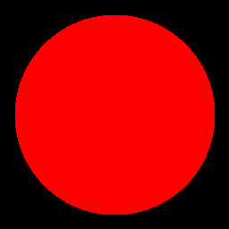
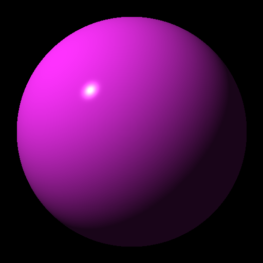
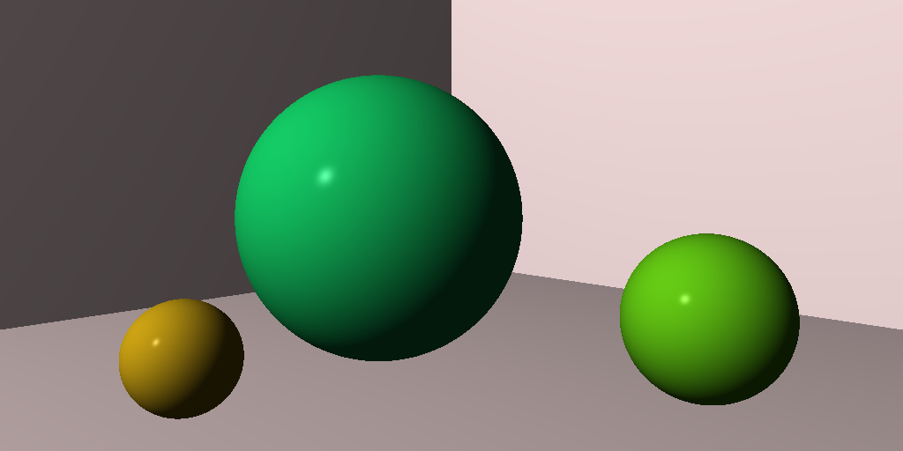

# Ray Tracer Challenge

An exercise in learning Rust.

See: https://pragprog.com/titles/jbtracer/the-ray-tracer-challenge/

## Chapter 2: Drawing on a Canvas

## Chapter 4: Matrix Transformations

## Chapter 5: Ray-Sphere Intersections

## Chapter 6: Light and Shading

## Chapter 7: Making a Scene

